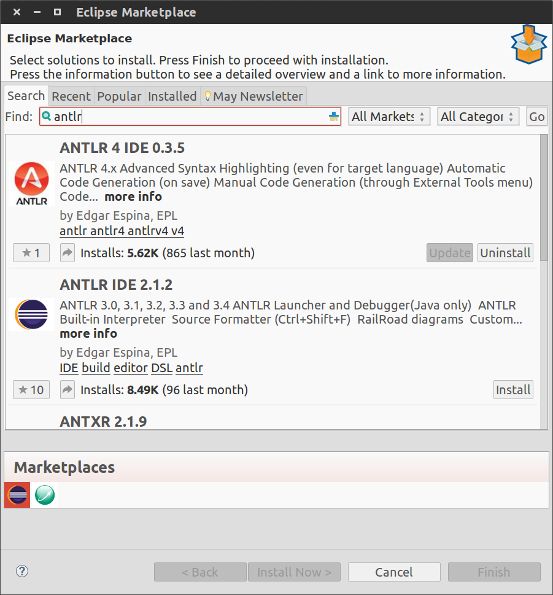
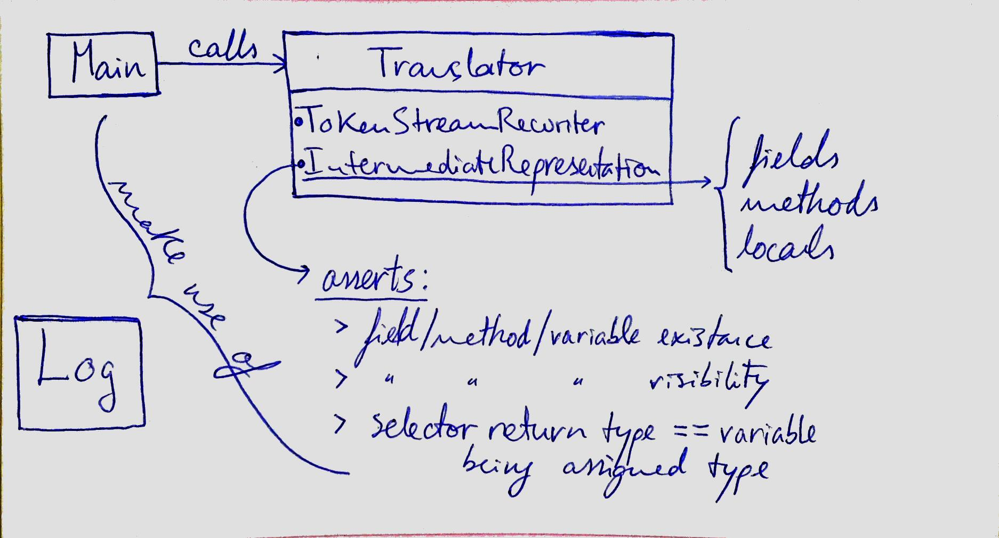

# JjQuery

## Authors

**Group name:** G51

**Project:** JjQuery

**Group members:**
- [Henrique Ferrolho](https://github.com/ferrolho)
- [João Pereira](https://github.com/jfpereira)
- [Rafaela Faria](https://github.com/rafikii)


## Build instructions

The project was developed using *Eclipse Luna*, with the *ANTLR v4* plugin.  
In order to install the plugin go to **Help > Eclipse Marketplace...**, search for `antlr` and install the plugin.



In order to recompile the project one must first import it by going to **File > Import...**, and then browse and select the **compiler** project folder and/or the **grammar** project folder.

The first folder contains the main project.  
The second contains the *JjQueryLexer.g4* and *JjQueryParser.g4*, which are the source files responsible of generating the project grammar.


## Examples

#### Example 1

This input is completely valid and generates an output Java file that can be compiled and run.  
The goal of this is example is to demonstrate the resultant output of a very simple input.

Here is the *diff* of the input and output files:

###### Input

```
/*@jQ
selected = $("students[toString()*='ri']");
*/
```

###### Output

```
// --- BEGIN --- jQuery block
// selected=$("students[toString()*='ri']");
for (int i = 0; i < students.size(); i++)
	if (students.get(i).toString().toLowerCase().contains("ri"))
		selected.add(students.get(i));
// --- END --- jQuery block
```

The translator surrounds the jQuery block with `// --- BEGIN --- jQuery block` and `// --- END --- jQuery block` to easily mark the resultant code of the jQuery translation.  
It also keeps the original code in a comment, before every translation.

#### Example 2


## How to use

The program can be run through the Terminal using the following command:

`java -jar G51.jar examples/Example1.java Main.java`

The command above will translate the **Example1.java** inside the **examples** folder and output the resultant translation to **Main.java**.

If the program is run without any CLI arguments, the output will be the following:
```
$ java -jar G51.jar
Error: Usage: Main.jar <input file> <output file>
Errors: 1,	Warnings: 0
```
 
 
## Lexical analysis

The lexer is located in the grammar project - **grammar/JjQueryLexer.g4**

When the input has lexical errors, the lexer generated by ANTLR will output the line where the error is located, followed by a message exaplaining which token was not recognized.

#### Example

The code below is a selector using an operator which is not supported by the translator - `#=`

```
18:	/*@jQ
19:	selected = $("students[toString()#='ri']");
20:	*/
```

The program will output the following:

```
line 19:35 token recognition error at: '#'
```


## Syntactic analysis

The parser is located in the grammar project - **grammar/JjQueryParser.g4**

When the input has syntactical errors, the parser generated by ANTLR will output the line where the error is located, followed by the expected/missing token.

#### Example

The code below is missing the `$` before the jQuery code, right after the `=`.

```
18:	/*@jQ
19:	selected = ("students[toString()*='ri']");
20:	*/
```

The program will output the following:

```
line 19:13 missing '$' at '('
```


## Semantic analysis

The semantic analysis is located in both **compiler/src/compiler/Translator.java** and **compiler/src/ir/IntermediateRepresentation.java**.

The first semantic analysis implemented was to check that the first **OP** token in the **assign** rule was an `=` and not any of the other possible operators explicit in the **OP** token:

```
@Override
public void enterAssign(@NotNull JjQueryParser.AssignContext ctx) {
	(...)
	
	if (!ctx.OP().getText().equals("="))
		Log.error("Expecting '=' on assignment, line " + currentLine);
	
	(...)
}
```

More advanced semantic analysis that make use of the intermediate representation are being made in **IntermediateRepresentation.java**.  
That class contains methods to validate whether a variable being used in a selector exists, is visible in the scope where it is being used, and also if the type of variable returned by a selector is the same as the type of the variable to which it is being assigned.  
These validations are made for local variables, class attributes, and also for methods (yes, the program supports the use of both variables and/or methods in a selector).

The validations described above are only possible by making use of the **intermediate representation**.  
Whenever the ANTLR **ParseTreeWalker** walks through a field declaration or a method definition, the program saves the modifiers, the type (or return type, for methods), and the name of that field/method. Afterwards, when the jQuery selector is being analysed, the program checks if the fields/methods being used by it have been previously saved, and if they are visible in that scope.  


## Intermediate representation

Below are the data structures used by the intermediate representation:

```
// map(field, field)
public HashMap<String, Field> fields;

// map(field, method)
public HashMap<String, Method> methods;

// map(field, local variable)
public HashMap<String, LocalVariable> locals;
```

These three collections store the information of the fields, methods, and local variables of the input in order to validate the selectors.  
The **locals** collection is cleared every time the walker exits a method declaration.

## Final code generation

The final output code is built using the **TokenStreamRewriter**. This ANTLR utility rewrites the entire input code as is, except for the tokens we choose to rewrite. The program uses this rewriter to translate the jQuery selectors into Java code.


## Tests

The program was tested with all the example inputs mentioned in a section above.


## Architecture

The image below is an overview of the program's architecture:



#### Supported selectors

Following is an extensive description of the selectors supported by the translator.

###### Attribute selector

`selected = $("collection[attribute operator value]")`

**selected** - the variable used to store the return of the selector  
**collection** - the collection of elements to be selected/filtered  
**attribute** - attribute (or method) used to obtain the value to be filtered  
**operator** - the operator to be applied on the **attribute** with the **value**  
**value** - the value to be used by the **operator**  


## The good

The program is very flexible regarding the possible methods/attributes that can be used in selectors. It also has a great and extensive validation of those methods/attributes.


## The bad

#### Bugs

When the jQuery selector uses native methods or attributes of an object/primitive, the program thinks they are undefined and triggers an error.  
Why? Since the user did not write the code for those methods, the walker does not traverse them, and thus does not store those methods in the intermediate representation.

```
Error: The method 'toString()' is undefined (line 19).
Errors: 1,	Warnings: 0
```

#### Future improvements

- Support more jQuery selectors
- Support translation in entire projects, in multiple files
