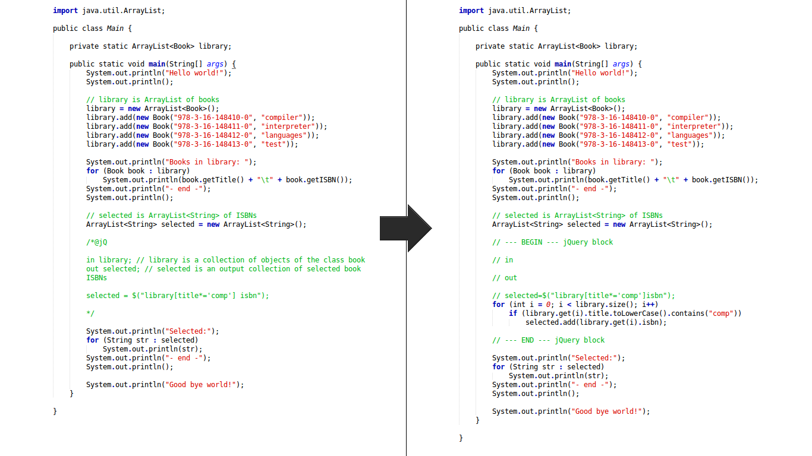

# JjQuery

## Authors

**Group name:** G51

**Project:** JjQuery

**Group members:**
- [Henrique Ferrolho](https://github.com/ferrolho)
- [João Pereira](https://github.com/jfpereira)
- [Rafaela Faria](https://github.com/rafikii)

## Build instructions

como é possível recompilar depois de realizar alterações ao código-fonte? Se tiver sido usado um IDE, devem indicar os passos para instalação, uso de potenciais plugins necessários, e incluir indicações sobre como abrir e compilar o projeto. (será aconselhável testar todos os passos num outro computador, ou numa máquina virtual, de forma a que as instruções sejam completas)

## Examples

para cada exemplo, devem indicar o que o exemplo pretende demonstrar e o resultado esperado

## How to use

Descrição de Utilização: como invocar a ferramenta a partir da linha de comandos (ou como correr, no caso de incluir interface gráfica)? Quais os parâmetros usados? (incluir exemplo de uso se possível) A ferramenta deve imprimir na consola esta informação de uso quando invocada sem argumentos na linha de comandos
 
## Lexical analysis
 
indicar em que ficheiro(s) está especificado o analisador lexical; indicar o que acontece quando o ficheiro de entrada contém erros lexicais

## Syntactic analysis

indicar em que ficheiro(s) está especificado o analisador sintático; descrever como lidam com erros sintáticos, qual a estratégia de recuperação (se existir), e como informam o utilizador dos erros detetados

## Semantic analysis

indicar em que ficheiro(s) está especificado o analisador semântico; descrever todas as validações semânticas implementadas (e possíveis construções e consultas de tabelas de símbolos); descrever como lidam com erros semânticos

## Intermediate representation

descrever a(s) representações intermédias utilizadas, e quais as transformações realizadas

## Final code generation

Descrever como é feita a geração de código final; identificar potenciais problemas relacionados com a geração de código

## Tests

descrever a infraestrutura de testes e a bateria de testes utilizados para testar a ferramenta desenvolvida (quantidade de testes, automação dos mesmos, etc.)

## Architecture

descrever a arquitetura geral da plataforma, principais algoritmos utilizados, e outros pontos que considerem relevantes para a avaliação. No caso particular dos trabalhos #1 (JjQuery) e #5 (JTM), devem documentar bem a linguagem de entrada

## The good

descrever os principais aspetos positivos relativos à ferramenta implementada; descrever todas as otimizações realizadas, e os 'extras' implementados

## The bad

descrever os principais aspetos negativos relativos à ferramenta implementada (bugs conhecidos, pontos de implementação incompleta e melhorias identificadas para potencial trabalho futuro)

## Preview

#####Fig. 1: JjQuery translates jQuery code embedded in Java to native Java.
